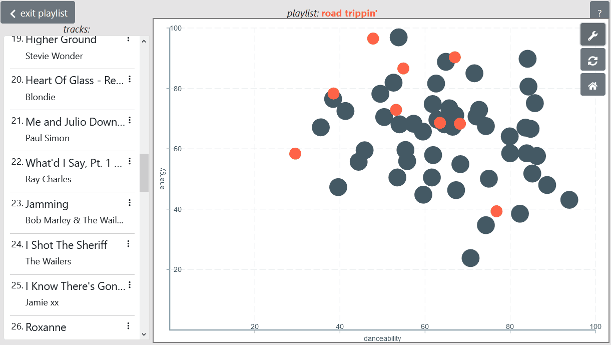
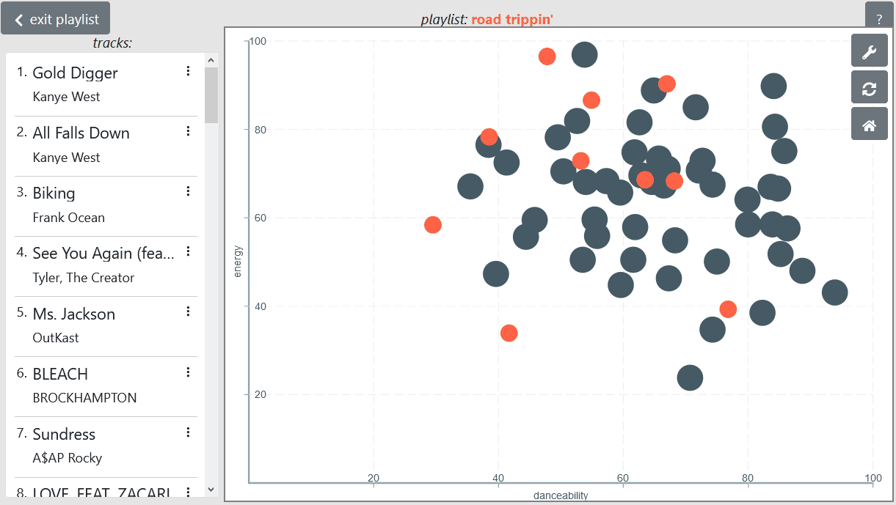

# The Playlist Obeservatory
This is a web app that takes the tracks off a spotify playlist and visually maps them in 2D space

Here's a live demo : http://playlistplot.xyz/

To run this app locally:  
1. first setup the server (More on that in the server readme).  
1. Start the server.  
1. Then run the client by going into the '/client' directory and executing 'npm install' then 'npm run start'

Make sure that the react app is run on localhost:3000 and the server is running on localhost:8888.

Here's what it looks like:  
## Change the axis 

   
  

## Add a track  
 

  
  

